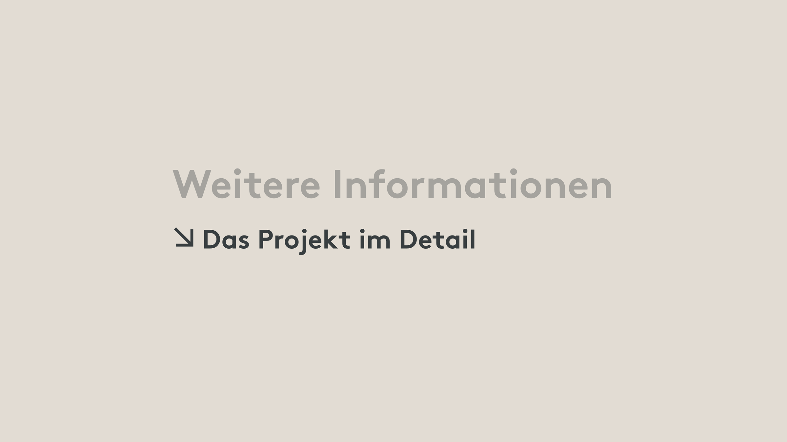

# UD Block: Projekt verknüpfen

Ein Block, der Magazin-Beiträge mit Projekten verknüpft.
Er ermöglicht es Redaktoren, im Editor gezielt einen Bezug zwischen einem Projekt und einem Magazinbeitrag herzustellen.

## Funktionen

- Verknüpft die Custom Post Types Magazin-Beiträge mit einem Projekt 
- Kompatibel mit **Full Site Editing (FSE)**

## Screenshots

*Darstellung der Projektverknüpfung im Frontend mit Icon und Titel.*

## Autor

[ulrich.digital gmbh](https://ulrich.digital)

## Lizenz

GPL v2 or later
[https://www.gnu.org/licenses/gpl-2.0.html](https://www.gnu.org/licenses/gpl-2.0.html)

