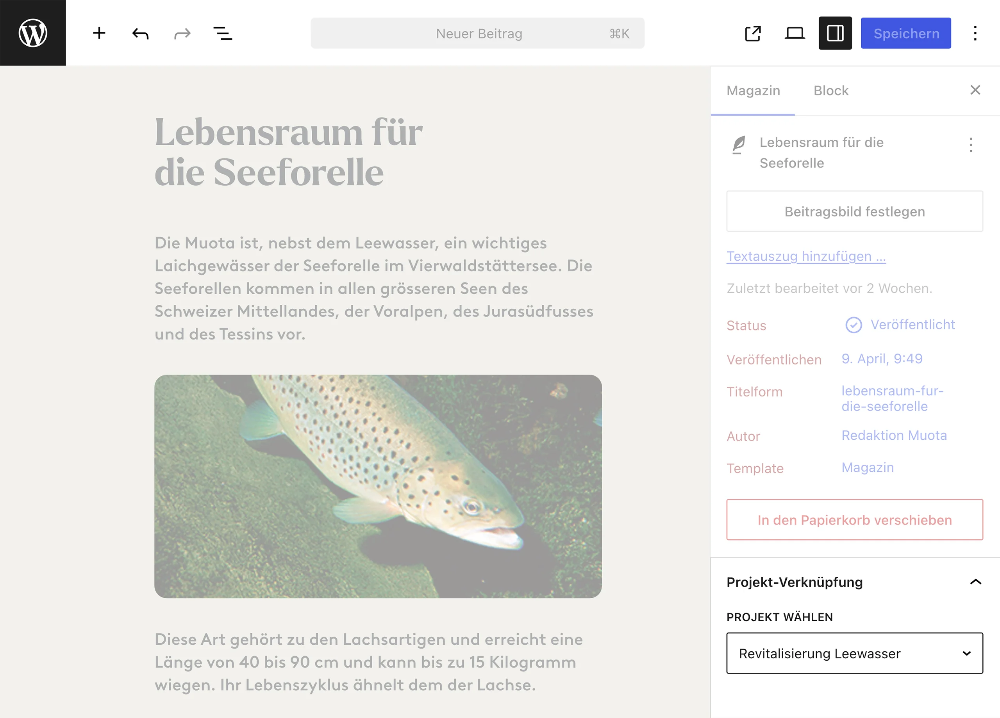
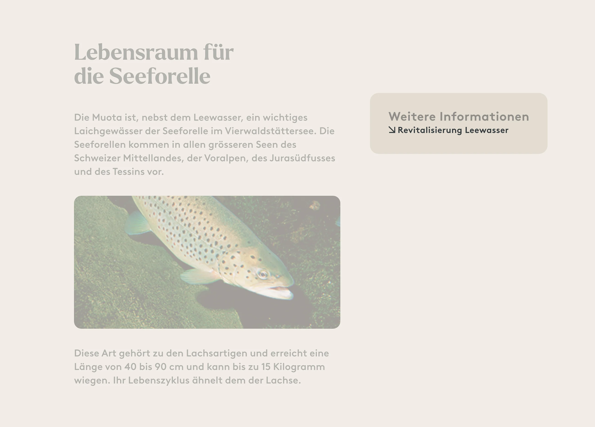

# UD Block: Projekt verknüpfen

Der dynamische Gutenberg-Block verbindet Magazinbeiträge mit Projekten. Die Redaktion wählt das zugehörige Projekt in der Dokument-Seitenleiste aus; WordPress speichert die Beziehung als Beitrags-Metadatum und gibt sie im Frontend als direkten Projektlink aus.

## Funktionen

- Verknüpft einen Magazinbeitrag vom Post Type `post` mit einem Inhalt vom Post Type `projekt`
- Ergänzt die Dokument-Seitenleiste um das Panel **Projekt-Verknüpfung**
- Lädt die verfügbaren Projekte über die WordPress REST API
- Speichert die ausgewählte Projekt-ID im Post Meta `ud_projekt_verknuepfen`
- Rendert Projekttitel und Permalink dynamisch im Frontend
- Zeigt die serverseitig erzeugte Ausgabe als Vorschau im Beitragseditor
- Unterstützt breite und vollbreite Blockausrichtungen
- Lässt sich in Full-Site-Editing-Templates einsetzen

## Redaktionsablauf

1. Magazinbeitrag im WordPress-Editor öffnen.
2. In der Dokument-Seitenleiste das Panel **Projekt-Verknüpfung** aufklappen.
3. Unter **Projekt wählen** das zugehörige Projekt auswählen.
4. Den Block **Projekt verknüpfen** an der vorgesehenen Stelle im Beitrag oder Template einsetzen.
5. Beitrag speichern beziehungsweise veröffentlichen.

Die Auswahl gehört zum gesamten Beitrag. Dadurch kann der Ausgabeblock passend im Layout platziert werden, während die Projektbeziehung zentral in den Beitragsdaten gespeichert bleibt.

## Frontend-Ausgabe

Der Block liest die gespeicherte Projekt-ID serverseitig aus und ermittelt daraus Projekttitel und Permalink. Die Ausgabe erscheint unter der Überschrift **Weitere Informationen** als direkter Link zum verknüpften Projekt.

Auf Einzelbeiträgen kann das Frontend-Skript den Projektlink zusätzlich in ein vorbereitetes Element mit der Klasse `.link_zum_projekt_im_head` übernehmen. Damit lässt sich die Projektverknüpfung an einer hervorgehobenen Position im Beitragstemplate ausgeben.

Das Pfeil-Icon verwendet Font-Awesome-Klassen. Das aktive Theme beziehungsweise die Website stellt die entsprechende Font-Awesome-Version bereit.

## Voraussetzungen

- WordPress mit Block-Editor
- Custom Post Type `projekt`
- REST-Freigabe des Projekt-Post-Types über `show_in_rest: true`
- Einsatz des Blocks im Beitrag oder Beitragstemplate
- Zielelement `.link_zum_projekt_im_head` für die zusätzliche Ausgabe im Kopfbereich
- Font Awesome für das Pfeil-Icon

## Technische Struktur

| Bereich | Umsetzung |
| --- | --- |
| Block | `ud/projekt-verknuepfen` |
| Ausgangsinhalt | Post Type `post` |
| Verknüpfter Inhalt | Post Type `projekt` |
| Speicherung | Post Meta `ud_projekt_verknuepfen` |
| Projektauswahl | REST API `/wp/v2/projekt?per_page=100` |
| Rendering | Dynamischer Block mit PHP-Render-Callback |
| Editor-Vorschau | `ServerSideRender` |
| Template-Integration | Zielelement `.link_zum_projekt_im_head` |

## Screenshots

### Auswahl im WordPress-Editor



Das zugehörige Projekt wird direkt in der Dokument-Seitenleiste des Magazinbeitrags ausgewählt.

### Ausgabe im Frontend



Der gespeicherte Projektbezug erscheint im Frontend als direkter Link unter «Weitere Informationen».

## Entwicklung

Abhängigkeiten installieren:

```bash
npm install
```

Produktionsdateien erstellen:

```bash
npm run build
```

Änderungen während der Entwicklung beobachten:

```bash
npm start
```

## Autor

[ulrich.digital gmbh](https://ulrich.digital)

## Lizenz

GPL v2 or later  
[https://www.gnu.org/licenses/gpl-2.0.html](https://www.gnu.org/licenses/gpl-2.0.html)
